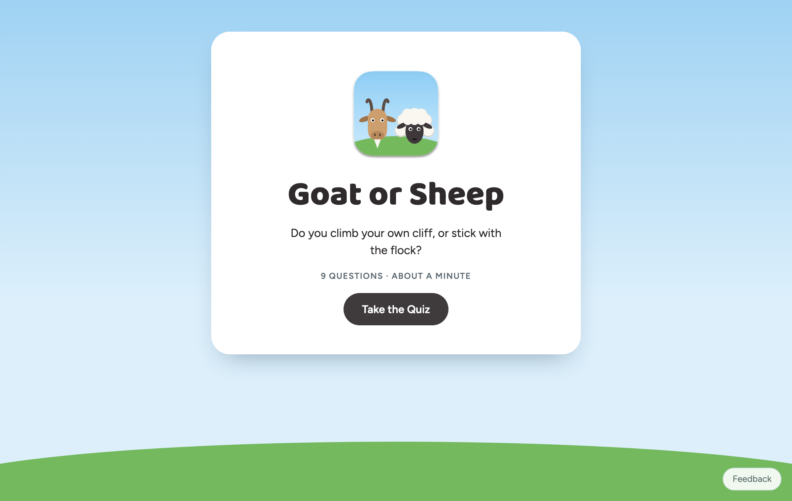
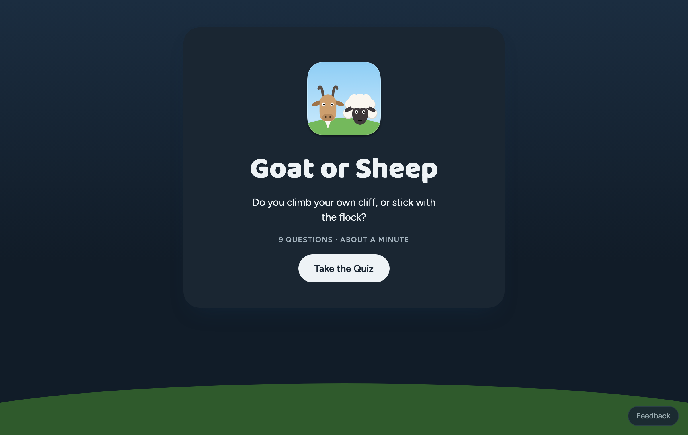
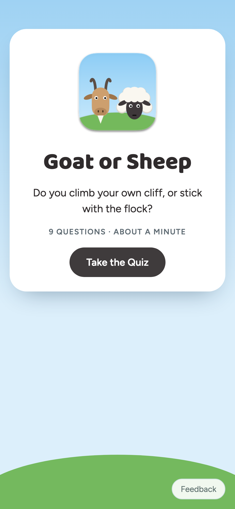
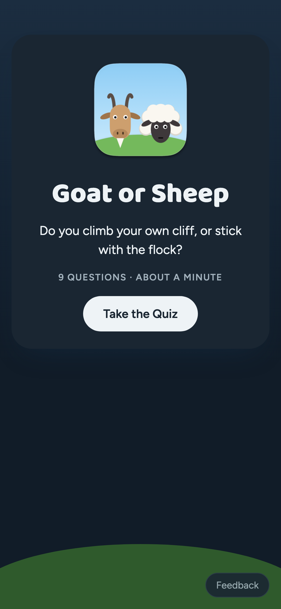

# Goat or Sheep

  
  
  

A little Mac app, plus a matching single-page website, with a nine-question personality quiz that tells you whether you're a **Goat** (you climb your own cliff) or a **Sheep** (you stick with the flock).

**Take the quiz in your browser: [amalmehta.github.io/goat-or-sheep](https://amalmehta.github.io/goat-or-sheep/)**

  
  
  
  

Setup, usage and how it works: **[docs/GUIDE.md](docs/GUIDE.md)**
