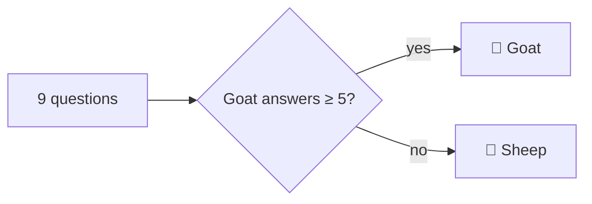

# Goat or Sheep Guide

## Requirements

- macOS 14 or later
- Xcode command-line tools (Swift 5.9+)

## Build and Open the App

```bash
./scripts/build-app.sh
open "build/Goat or Sheep.app"
```

You can also drag `build/Goat or Sheep.app` into `/Applications`. For a quick run during development, use `swift run GoatOrSheep`.

## Using It

1. Click **Take the Quiz**.
2. Answer nine questions. Click an answer or press **1–4**. Use **Back** to change your last answer.
3. The result screen shows whether you're a Goat or a Sheep, plus how many answers went each way. Click **Take It Again** to start over.

The **Feedback** button in the bottom-right corner opens a short form. **Open Email** starts a pre-filled draft in your mail app. Nothing is sent until you send it there.

## How Scoring Works

Every question has two goat answers and two sheep answers. There are nine questions, so there can't be a tie: five or more goat answers makes you a Goat. The questions live in `Sources/GoatOrSheepKit/Quiz.swift`.



## Project Layout

| Path | What it is |
|---|---|
| `Sources/GoatOrSheepKit/` | Quiz questions, scoring and all the screens |
| `Sources/GoatOrSheep/` | The app entry point and window |
| `Sources/RenderScreenshots/` | Regenerates the README screenshots |
| `Tests/` | Tests for scoring, quiz flow and the feedback email link |
| `scripts/build-app.sh` | Builds `build/Goat or Sheep.app` |

## Development

```bash
swift test
swift run RenderScreenshots docs/screenshots
```
